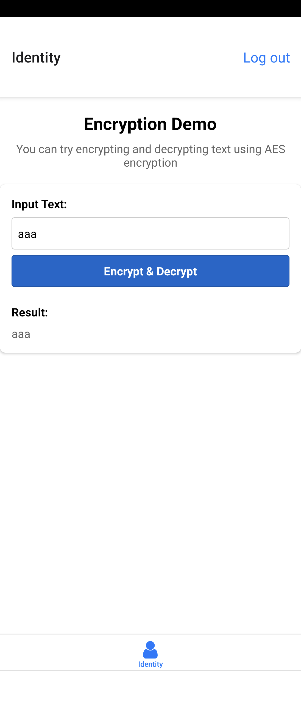

# `expo-icp-vetkeys`

`expo-icp-keys`プロジェクトへようこそ。
英語版は[こちら](README.md)です。

## デモ

<a href="https://csbju-6qaaa-aaaag-at7da-cai.icp0.io/?v=1" target="_blank" rel="noopener noreferrer">https://csbju-6qaaa-aaaag-at7da-cai.icp0.io/</a>
(Ctrl+Click or ⌘+Click to open in new tab)

### スクリーンショット

- iPhone
  

- Xperia
  

## サービスコンセプト

Expo アプリで Internet Identity を数行のコードを書くだけで簡単に使える、マルチプラットフォーム(iOS/Android/Web)認証ソリューションです。これまでほとんど存在していなかった ICP のスマホネイティブアプリを簡単に作成できるテンプレートも提供しています。

## 利用ユーザ想定（ターゲット）

- Web/ネイティブのクロスプラットフォーム開発者
- Internet Computer Protocol（ICP）上でアプリケーションを構築したい開発者
- セキュアな認証システムを導入したいモバイルアプリ開発者

## メリットや特徴

- これまで難しかったスマホネイティブアプリでの Internet Identity 認証を簡単に実装可能
- Expo Web と Native 両方で同じライブラリを使って Internet Identity による認証が可能
- 複数のプラットフォーム（Web/iOS/Android）で一貫した認証体験を提供
- 開発環境からデプロイまでのワークフローを簡素化

## 実装方法

以下の簡単なステップで Internet Identity 認証を実装できます：

1. **認証プロバイダーの設定**：アプリケーションの入り口ファイルでプロバイダーを設定

```typescript
// app/_layout.tsx で IIIntegrationProvider を準備
import { useIIIntegration, IIIntegrationProvider } from 'expo-ii-integration';

const auth = useIIIntegration({
  localIPAddress: LOCAL_IP_ADDRESS,
  dfxNetwork: ENV_VARS.DFX_NETWORK,
  iiIntegrationCanisterId: ENV_VARS.CANISTER_ID_II_INTEGRATION,
  iiCanisterId: ENV_VARS.CANISTER_ID_INTERNET_IDENTITY,
});

return <IIIntegrationProvider value={auth}>...</IIIntegrationProvider>;
```

2. **ログイン機能の実装**：わずか数行でログイン機能を追加

```typescript
// components/LogIn.tsx でログイン関数を利用
import { useIIIntegrationContext } from 'expo-ii-integration';

const { login } = useIIIntegrationContext();

await login();
```

3. **ログアウト機能の実装**：同様に簡単にログアウト機能も追加可能

```typescript
// components/LogOut.tsx でログアウト関数を利用
import { useIIIntegrationContext } from 'expo-ii-integration';

const { logout } = useIIIntegrationContext();

await logout();
```

4. **バックエンド連携**：認証済みの identity を使ってバックエンド Canister を呼び出し

```typescript
// components/WhoAmI.tsx でバックエンド Canister の呼び出し
import { useIIIntegrationContext } from 'expo-ii-integration';
import { createBackend } from '@/backend';

const { identity } = useIIIntegrationContext();

const backend = createBackend(identity);
await backend.whoami();
```

## ICP の仕組みをどの部分で使っているか

- 「Internet Identity (II)」によるパスワード不要の安全な認証システム
  - WebAuthn/パスキーを活用した最新の認証規格に準拠
  - 複数デバイス間での認証情報の安全な共有
- ICP バックエンドとの連携によるフルスタック環境の構築
  - バックエンド呼び出し時の認証情報の自動連携
  - クラウドサービス不要のフルスタック環境
- WebAssembly ベースの統一実行環境を活用したバックエンド処理
  - ICP のキャニスター（バックエンド）が WebAssembly 上で動作
  - 高速で安全なサーバー処理を実現

## なぜ ICP の仕組みを活用して開発したか、その優位性や理由

従来のパスキーを使った認証システムでは、サーバーサイドの実装が必要です。個別に実装するのはコストがかかるだけではなく、セキュリティリスクを伴います。
実績のある Internet Identity のパスキー認証を使うことで、セキュリティリスクを減らし、コストを削減することができます。

また、Internet Identity の認証は、バックエンド Canister の呼び出し元認証と統合されています。自前実装する必要ないのは、セキュリティ面でもコストの面でも大きなメリットです。

### 主なメリット

- **セキュリティの向上**：実績のある認証システムを利用することでリスクを軽減
- **開発コストの削減**：認証システムの実装・維持コストを大幅に削減
- **ユーザー体験の向上**：パスワードレスで安全かつ簡単な認証体験の提供
- **統合環境の実現**：フロントエンドからバックエンドまで一貫した認証フロー

## 今回開発した関連ライブラリ

- [expo-ii-integration](https://github.com/higayasuo/expo-ii-integration) - Expo Web/Native から Internet Identity にアクセスするためのライブラリ
- [@higayasuo/iframe-messenger](https://github.com/higayasuo/iframe-messenger) - iframe 経由で type-safe なメッセージ通信を行うライブラリ
- [canister-manager](https://github.com/higayasuo/canister-manager) - 環境に依存する canister URL の問題を解決するライブラリ
- [expo-storage-universal](https://github.com/higayasuo/expo-storage-universal) - Web/Native から統一的にストレージにアクセスするライブラリ
- [expo-storage-universal-web](https://github.com/higayasuo/expo-storage-universal-web) - expo-storage-universal の Web 実装
- [expo-storage-universal-native](https://github.com/higayasuo/expo-storage-universal-native) - expo-storage-universal の Native 実装

## ドキュメント

- [動作の仕組み](docs/how_it_works_ja.md)
- [セットアップガイド](docs/setup_ja.md)

## リポジトリの commits

以下のリンクから各リポジトリの開発履歴を確認できます。実装の詳細や変更履歴を追跡したい場合に参照してください：

- [expo-icp](https://github.com/higayasuo/expo-icp/commits?author=higayasuo)
- [expo-ii-integration](https://github.com/higayasuo/expo-ii-integration/commits?author=higayasuo)
- [@higayasuo/iframe-messenger](https://github.com/higayasuo/iframe-messenger/commits?author=higayasuo)
- [canister-manager](https://github.com/higayasuo/canister-manager/commits?author=higayasuo)
- [expo-storage-universal](https://github.com/higayasuo/expo-storage-universal/commits?author=higayasuo)
- [expo-storage-universal-web](https://github.com/higayasuo/expo-storage-universal-web/commits?author=higayasuo)
- [expo-storage-universal-native](https://github.com/higayasuo/expo-storage-universal-native/commits?author=higayasuo)
